# Nyaya Multi-Agent Architecture with Role-Aware RAG

## System Overview

Nyaya is an intelligent legal document analysis system that uses **role-based classification** and **multi-agent orchestration** to provide precise answers to legal queries. The system handles document uploads, similarity searches, outcome predictions, and context-aware follow-up questions.

---

## Core Architecture

```mermaid
graph TB
    User[👤 User] -->|Upload Case / Ask Query| FrontEnd[🖥️ React Frontend]
    FrontEnd --> FastAPI[⚡ FastAPI Backend]
    
    FastAPI --> IntentRouter{🎯 Intent Detection<br/>LangGraph Router}
    
    IntentRouter -->|File Upload| ClassifyAgent[🔬 Classification Agent]
    IntentRouter -->|"Find similar cases"| SimAgent[🔍 Similarity Agent]
    IntentRouter -->|"Predict outcome"| PredAgent[🔮 Prediction Agent]
    IntentRouter -->|"Q&A / Follow-up"| RAGAgent[💬 RAG Agent]
    
    ClassifyAgent --> InLegalBERT[🤖 InLegalBERT<br/>Role Classifier]
    InLegalBERT --> Embedder[📊 EmbeddingGemma<br/>384-dim]
    Embedder --> Pinecone[(🗄️ Pinecone<br/>Vector DB)]
    
    SimAgent --> Pinecone
    PredAgent --> Pinecone
    RAGAgent --> Pinecone
    
    SimAgent --> ContextManager[📝 Context Manager<br/>Conversation History]
    PredAgent --> ContextManager
    RAGAgent --> ContextManager
    
    SimAgent --> LLM[🧠 Gemini LLM<br/>Response Generation]
    PredAgent --> LLM
    RAGAgent --> LLM
    
    LLM --> FrontEnd
    
    style Pinecone fill:#e1f5ff
    style InLegalBERT fill:#fff3e0
    style LLM fill:#f3e5f5
    style ContextManager fill:#e8f5e9
```



---

## Detailed Component Architecture

### 1. Intent Detection & Routing Layer

```mermaid
graph LR
    UserInput[User Input] --> IntentDetector{Intent Detector}
    
    IntentDetector -->|Has file attachment| Upload[UPLOAD_AND_CLASSIFY]
    IntentDetector -->|"similar", "like", "related"| Similar[SIMILARITY_SEARCH]
    IntentDetector -->|"predict", "outcome", "chances"| Predict[PREDICT_OUTCOME]
    IntentDetector -->|"what", "explain", "tell me"| QA[QUESTION_ANSWERING]
    IntentDetector -->|"facts", "reasoning", "decision"| RoleQA[ROLE_SPECIFIC_QA]
    
    Upload --> ClassificationAgent
    Similar --> SimilarityAgent
    Predict --> PredictionAgent
    QA --> RAGAgent
    RoleQA --> RAGAgent
    
    style IntentDetector fill:#ffeb3b
```

**Intent Detection Logic:**
- Analyzes user input (text + attachments)
- Checks conversation context for follow-up patterns
- Routes to appropriate specialized agent
- Maintains conversation state across turns

---

### 2. Classification Agent (File Upload Flow)

```mermaid
sequenceDiagram
    participant User
    participant FastAPI
    participant ClassifyAgent
    participant InLegalBERT
    participant EmbeddingGemma
    participant Pinecone
    participant ContextMgr
    
    User->>FastAPI: Upload case.pdf
    FastAPI->>ClassifyAgent: Process file
    
    ClassifyAgent->>ClassifyAgent: Extract text from PDF
    ClassifyAgent->>ClassifyAgent: Split into sentences
    
    ClassifyAgent->>InLegalBERT: Classify sentences
    Note over InLegalBERT: Assigns 7 roles:<br/>Facts, Issue, Arguments (P/R),<br/>Reasoning, Decision, None
    InLegalBERT-->>ClassifyAgent: Classified sentences with roles
    
    loop For each sentence
        ClassifyAgent->>EmbeddingGemma: Generate embedding
        Note over EmbeddingGemma: 384-dim vector<br/>prompt="Retrieval-document"
        EmbeddingGemma-->>ClassifyAgent: Embedding vector
        
        ClassifyAgent->>Pinecone: Upsert vector + metadata
        Note over Pinecone: metadata: {<br/>  text, role, confidence,<br/>  case_id, sentence_idx<br/>}
    end
    
    ClassifyAgent->>ContextMgr: Store case_id + metadata
    Note over ContextMgr: case_id: "case_12345"<br/>roles: {Facts: 23, Issue: 5, ...}
    
    ClassifyAgent-->>FastAPI: Classification summary
    FastAPI-->>User: ✅ Case analyzed!<br/>23 Facts, 5 Issues, ...
```



**Key Points:**
- Each sentence gets its own vector in Pinecone
- Role metadata enables role-filtered searches later
- Case ID links all sentences of same case
- Context manager tracks uploaded cases for follow-ups

---

### 3. Similarity Search Agent (Role-Aware)


**Role-Wise Similarity Algorithm:**

```python
# For uploaded case_12345
uploaded_vectors = get_vectors_by_case_id("case_12345")

# Group by role
vectors_by_role = {
    "Facts": [...],
    "Issue": [...],
    "Reasoning": [...],
    "Decision": [...]
}

# Search each role separately
similarity_scores = {}

for role, vectors in vectors_by_role.items():
    # Get average embedding for this role
    avg_embedding = mean(vectors)
    
    # Search Pinecone with role filter
    results = pinecone.query(
        vector=avg_embedding,
        filter={"role": role},
        exclude_case_id="case_12345"  # Don't match self
    )
    
    # Accumulate scores by case_id
    for match in results:
        case_id = match.metadata.case_id
        if case_id not in similarity_scores:
            similarity_scores[case_id] = {}
        similarity_scores[case_id][role] = match.score

# Calculate weighted overall similarity
for case_id, role_scores in similarity_scores.items():
    overall = (
        role_scores.get("Facts", 0) * 0.4 +
        role_scores.get("Reasoning", 0) * 0.3 +
        role_scores.get("Issue", 0) * 0.3
    )
    similarity_scores[case_id]["overall"] = overall
```

---

### 4. Prediction Agent (Outcome Prediction)

```mermaid
sequenceDiagram
    participant User
    participant FastAPI
    participant PredictionAgent
    participant ContextMgr
    participant Pinecone
    participant LLM
    
    User->>FastAPI: "What could be the outcome of my case?"
    FastAPI->>PredictionAgent: Execute prediction
    
    PredictionAgent->>ContextMgr: Get user's case_id
    ContextMgr-->>PredictionAgent: case_id="case_12345"
    
    PredictionAgent->>Pinecone: Find similar cases (role-wise)
    Note over Pinecone: Use Similarity Agent logic<br/>to find top 20 similar cases
    Pinecone-->>PredictionAgent: Similar cases list
    
    loop For each similar case
        PredictionAgent->>Pinecone: Query Decision role vectors
        Note over Pinecone: filter = {<br/>  role: "Decision",<br/>  case_id: "similar_case_X"<br/>}
        Pinecone-->>PredictionAgent: Decision text
        
        PredictionAgent->>PredictionAgent: Extract outcome
        Note over PredictionAgent: Parse decision text:<br/>- "allowed" → Favorable<br/>- "dismissed" → Unfavorable<br/>- "remanded" → Neutral
    end
    
    PredictionAgent->>PredictionAgent: Calculate statistics
    Note over PredictionAgent: 15 similar cases:<br/>- 11 Favorable (73%)<br/>- 3 Unfavorable (20%)<br/>- 1 Neutral (7%)
    
    PredictionAgent->>Pinecone: Get Reasoning from similar cases
    Note over Pinecone: Extract reasoning patterns<br/>from favorable outcomes
    Pinecone-->>PredictionAgent: Key reasoning points
    
    PredictionAgent->>LLM: Generate prediction report
    Note over LLM: Context:<br/>- User's case Facts/Issue<br/>- Similar cases' Decisions<br/>- Common Reasoning patterns<br/>Generate: Prediction + Justification
    
    LLM-->>PredictionAgent: Prediction with explanation
    PredictionAgent->>ContextMgr: Store prediction for follow-ups
    PredictionAgent-->>FastAPI: Prediction report
    FastAPI-->>User: 🔮 Predicted: Favorable (73%)<br/>Key factors: privacy rights...
```



**Outcome Extraction Logic:**

```python
def extract_outcome(decision_text: str) -> str:
    """Parse decision text to determine outcome."""
    
    decision_lower = decision_text.lower()
    
    # Favorable patterns
    if any(word in decision_lower for word in [
        "allowed", "granted", "upheld", "favor", "succeeded"
    ]):
        return "Favorable"
    
    # Unfavorable patterns
    elif any(word in decision_lower for word in [
        "dismissed", "rejected", "denied", "against"
    ]):
        return "Unfavorable"
    
    # Neutral/Mixed
    elif any(word in decision_lower for word in [
        "remanded", "partly", "modified"
    ]):
        return "Neutral"
    
    else:
        return "Unknown"
```

---

### 5. RAG Agent (Question Answering with Context)

```mermaid
sequenceDiagram
    participant User
    participant FastAPI
    participant RAGAgent
    participant ContextMgr
    participant EmbeddingGemma
    participant Pinecone
    participant LLM
    
    User->>FastAPI: "What were the facts in my case?"
    FastAPI->>RAGAgent: Process question
    
    RAGAgent->>ContextMgr: Get conversation context
    ContextMgr-->>RAGAgent: Recent case_id + history
    
    RAGAgent->>RAGAgent: Detect role in question
    Note over RAGAgent: Keywords: "facts" → Role: Facts
    
    RAGAgent->>EmbeddingGemma: Embed query
    Note over EmbeddingGemma: prompt="Retrieval-query"
    EmbeddingGemma-->>RAGAgent: Query embedding
    
    RAGAgent->>Pinecone: Search with filters
    Note over Pinecone: filter = {<br/>  case_id: "case_12345",<br/>  role: "Facts"<br/>}
    Pinecone-->>RAGAgent: Top 5 matching Facts
    
    RAGAgent->>LLM: Generate answer
    Note over LLM: System: Legal assistant<br/>Context: Retrieved Facts<br/>Question: User's question<br/>Generate: Natural answer
    
    LLM-->>RAGAgent: Generated answer
    RAGAgent->>ContextMgr: Update conversation history
    RAGAgent-->>FastAPI: Answer with sources
    FastAPI-->>User: The petitioner filed...
    
    Note over User,FastAPI: Follow-up question
    
    User->>FastAPI: "And what was the decision?"
    FastAPI->>RAGAgent: Process follow-up
    
    RAGAgent->>ContextMgr: Get context
    ContextMgr-->>RAGAgent: Still case_12345, previous Q about Facts
    
    RAGAgent->>RAGAgent: Resolve "the decision" → same case
    Note over RAGAgent: Context resolution:<br/>"the decision" = Decision role of case_12345
    
    RAGAgent->>Pinecone: Search with role=Decision
    Note over Pinecone: filter = {<br/>  case_id: "case_12345",<br/>  role: "Decision"<br/>}
    Pinecone-->>RAGAgent: Decision sentences
    
    RAGAgent->>LLM: Generate answer
    LLM-->>RAGAgent: Decision summary
    RAGAgent->>ContextMgr: Update history
    RAGAgent-->>FastAPI: Answer
    FastAPI-->>User: Section 377 was declared...
```



---

### 6. Context Manager (Conversation State)

```mermaid
graph TB
    subgraph "Context Manager State"
        SessionID[Session ID: abc123]
        
        CurrentCase[Current Case:<br/>case_12345]
        
        History[Conversation History:<br/>1. User uploaded case<br/>2. Asked about facts<br/>3. Asked about decision]
        
        CaseMetadata[Case Metadata:<br/>- case_id: case_12345<br/>- roles: {Facts: 23, Issue: 5}<br/>- uploaded_at: timestamp]
        
        SimilarCases[Similar Cases Cache:<br/>- case_789 (89% similar)<br/>- case_456 (85% similar)]
        
        PredictionCache[Prediction Results:<br/>- outcome: Favorable<br/>- confidence: 73%]
    end
    
    UserQuery[New User Query] --> ContextResolver{Context Resolver}
    
    ContextResolver --> CurrentCase
    ContextResolver --> History
    ContextResolver --> CaseMetadata
    
    ContextResolver --> ResolvedQuery[Resolved Query with Context]
    
    style ContextResolver fill:#4caf50
    style ResolvedQuery fill:#8bc34a
```

**Context Resolution Examples:**

| User Input | Context | Resolved Query |
|------------|---------|----------------|
| "Upload case.pdf" | None | Upload new case |
| "Find similar cases" | case_12345 uploaded | Find cases similar to case_12345 |
| "What were the facts?" | case_12345 active | Get Facts role from case_12345 |
| "And the decision?" | Previous Q about case_12345 | Get Decision role from case_12345 |
| "Compare with that case" | case_789 mentioned earlier | Compare case_12345 with case_789 |
| "What about privacy cases?" | No active case | General search for privacy cases |

---

## Data Flow Architecture

### 7. Pinecone Vector Storage Schema


**Namespace Strategy:**

```
nyaya-legal-rag (Index)
├── user_documents (Namespace)
│   ├── case_12345_sent_0 (User uploaded case)
│   ├── case_12345_sent_1
│   └── ...
│
├── training_data (Namespace)
│   ├── navtej_singh_sent_0 (Pre-classified cases)
│   ├── navtej_singh_sent_1
│   └── ...
│
└── demo (Namespace)
    ├── demo_case_sent_0 (Demo/test data)
    └── ...
```

---

## Complete User Journey Examples

### Example 1: Upload → Similarity → Prediction

```mermaid
sequenceDiagram
    participant User
    participant System
    participant Pinecone
    participant LLM
    
    Note over User,LLM: Turn 1: Upload Case
    User->>System: Upload privacy_case.pdf
    System->>System: Classify sentences (InLegalBERT)
    System->>Pinecone: Store 156 vectors with roles
    System-->>User: ✅ Case analyzed! case_id=case_12345<br/>45 Facts, 12 Issues, 38 Reasoning...
    
    Note over User,LLM: Turn 2: Find Similar Cases
    User->>System: "Find cases similar to this"
    System->>Pinecone: Role-wise similarity search
    Note over Pinecone: Search Facts, Issue, Reasoning<br/>separately, then aggregate
    Pinecone-->>System: Top 10 similar cases
    System->>LLM: Summarize similarities
    LLM-->>System: Comparison summary
    System-->>User: 🔍 Found 10 similar cases:<br/>1. Navtej Singh (89% similar)<br/>2. Puttaswamy (85% similar)...
    
    Note over User,LLM: Turn 3: Predict Outcome
    User->>System: "What could be the outcome?"
    System->>Pinecone: Get Decisions from similar cases
    Pinecone-->>System: 11 Favorable, 3 Unfavorable
    System->>LLM: Generate prediction
    Note over LLM: Context: Similar cases' decisions<br/>+ reasoning patterns
    LLM-->>System: Prediction + justification
    System-->>User: 🔮 Predicted: Favorable (73%)<br/>Key: Privacy rights precedent strong
    
    Note over User,LLM: Turn 4: Follow-up Question
    User->>System: "Why is privacy important here?"
    System->>Pinecone: Search Reasoning role in case_12345
    Pinecone-->>System: Reasoning sentences
    System->>LLM: Explain reasoning
    LLM-->>System: Natural language explanation
    System-->>User: Privacy is intrinsic to Article 21...
```



---

### Example 2: General Search → Detailed Analysis


---

## Technical Implementation Details

### 8. Agent Orchestration with LangGraph

```python
from langgraph.graph import StateGraph, END
from typing import TypedDict, Literal

class AgentState(TypedDict):
    """Shared state across all agents."""
    messages: list              # Conversation history
    user_query: str            # Current query
    intent: str                # Detected intent
    case_id: str | None        # Active case ID
    uploaded_file: dict | None # File attachment
    search_results: list       # Retrieved vectors
    similar_cases: list        # Similar case IDs
    prediction: dict | None    # Prediction results
    final_answer: str          # Response to user
    
# Build workflow
workflow = StateGraph(AgentState)

# Add nodes (agents)
workflow.add_node("detect_intent", detect_intent_node)
workflow.add_node("classify", classification_agent)
workflow.add_node("similarity", similarity_agent)
workflow.add_node("prediction", prediction_agent)
workflow.add_node("rag", rag_agent)
workflow.add_node("format", format_response)

# Set entry point
workflow.set_entry_point("detect_intent")

# Conditional routing
workflow.add_conditional_edges(
    "detect_intent",
    route_to_agent,  # Function that returns agent name
    {
        "classify": "classify",
        "similarity": "similarity",
        "prediction": "prediction",
        "rag": "rag"
    }
)

# All agents converge to formatter
workflow.add_edge("classify", "format")
workflow.add_edge("similarity", "format")
workflow.add_edge("prediction", "format")
workflow.add_edge("rag", "format")

# End after formatting
workflow.add_edge("format", END)

# Compile
app = workflow.compile()
```

---

### 9. Role-Wise Similarity Search Algorithm

```python
def role_wise_similarity_search(
    uploaded_case_id: str,
    top_k: int = 10,
    role_weights: dict = None
) -> list[dict]:
    """
    Find similar cases using role-aware vector search.
    
    Args:
        uploaded_case_id: User's uploaded case
        top_k: Number of similar cases to return
        role_weights: Weight for each role in similarity calculation
    
    Returns:
        List of similar cases with similarity scores
    """
    
    if role_weights is None:
        role_weights = {
            "Facts": 0.25,
            "Issue": 0.25,
            "Reasoning": 0.30,
            "Decision": 0.20
        }
    
    # Step 1: Get all vectors for uploaded case
    uploaded_vectors = pinecone.query(
        filter={"case_id": uploaded_case_id},
        top_k=1000,  # Get all
        include_metadata=True
    )
    
    # Step 2: Group by role
    vectors_by_role = {}
    for vector in uploaded_vectors:
        role = vector.metadata.role
        if role not in vectors_by_role:
            vectors_by_role[role] = []
        vectors_by_role[role].append(vector.values)
    
    # Step 3: For each role, search similar vectors in database
    case_similarities = {}  # {case_id: {role: score}}
    
    for role, vectors in vectors_by_role.items():
        # Calculate average embedding for this role
        avg_embedding = np.mean(vectors, axis=0)
        
        # Search Pinecone with role filter
        results = pinecone.query(
            vector=avg_embedding.tolist(),
            filter={
                "role": role,
                "case_id": {"$ne": uploaded_case_id}  # Exclude self
            },
            top_k=50,
            include_metadata=True
        )
        
        # Accumulate scores by case_id
        for match in results.matches:
            case_id = match.metadata.case_id
            
            if case_id not in case_similarities:
                case_similarities[case_id] = {}
            
            # Store max score for this role
            if role not in case_similarities[case_id]:
                case_similarities[case_id][role] = match.score
            else:
                case_similarities[case_id][role] = max(
                    case_similarities[case_id][role],
                    match.score
                )
    
    # Step 4: Calculate weighted overall similarity
    similar_cases = []
    
    for case_id, role_scores in case_similarities.items():
        # Weighted average
        overall_score = sum(
            role_scores.get(role, 0) * weight
            for role, weight in role_weights.items()
        )
        
        similar_cases.append({
            "case_id": case_id,
            "overall_similarity": overall_score,
            "role_scores": role_scores,
            "matching_roles": list(role_scores.keys())
        })
    
    # Step 5: Sort by overall similarity
    similar_cases.sort(key=lambda x: x["overall_similarity"], reverse=True)
    
    return similar_cases[:top_k]
```

---

### 10. Context Management Implementation

```python
class ContextManager:
    """Manages conversation context and state."""
    
    def __init__(self):
        self.sessions = {}  # {session_id: SessionContext}
    
    def get_or_create_session(self, session_id: str) -> SessionContext:
        if session_id not in self.sessions:
            self.sessions[session_id] = SessionContext()
        return self.sessions[session_id]
    
    def update_context(
        self,
        session_id: str,
        user_query: str,
        agent_response: str,
        metadata: dict
    ):
        """Update context after each turn."""
        session = self.get_or_create_session(session_id)
        
        # Add to history
        session.history.append({
            "user": user_query,
            "assistant": agent_response,
            "timestamp": datetime.now(),
            "metadata": metadata
        })
        
        # Update active case if applicable
        if "case_id" in metadata:
            session.active_case_id = metadata["case_id"]
        
        # Cache results for follow-ups
        if "similar_cases" in metadata:
            session.similar_cases_cache = metadata["similar_cases"]
        
        if "prediction" in metadata:
            session.prediction_cache = metadata["prediction"]
    
    def resolve_references(
        self,
        session_id: str,
        query: str
    ) -> dict:
        """
        Resolve pronouns and references in query.
        
        Examples:
        - "it" → the active case
        - "that case" → last mentioned case
        - "the decision" → Decision role of active case
        """
        session = self.get_or_create_session(session_id)
        
        resolved = {
            "original_query": query,
            "resolved_query": query,
            "case_id": None,
            "referenced_cases": []
        }
        
        query_lower = query.lower()
        
        # Resolve "it", "this case", "my case"
        if any(word in query_lower for word in ["it", "this case", "my case"]):
            if session.active_case_id:
                resolved["case_id"] = session.active_case_id
                resolved["resolved_query"] = query.replace(
                    "it", f"case {session.active_case_id}"
                )
        
        # Resolve "that case" → last mentioned case in similar results
        if "that case" in query_lower and session.similar_cases_cache:
            last_case = session.similar_cases_cache[0]["case_id"]
            resolved["referenced_cases"].append(last_case)
        
        # Resolve "the decision" → Decision role
        if any(word in query_lower for word in ["the facts", "the decision", "the reasoning"]):
            if session.active_case_id:
                resolved["case_id"] = session.active_case_id
        
        return resolved

class SessionContext:
    """Context for a single user session."""
    
    def __init__(self):
        self.session_id: str = str(uuid.uuid4())
        self.active_case_id: str | None = None
        self.history: list[dict] = []
        self.similar_cases_cache: list[dict] = []
        self.prediction_cache: dict | None = None
        self.created_at: datetime = datetime.now()
        self.last_activity: datetime = datetime.now()
```

---

## Deployment Architecture


---

## Key Advantages of This Architecture

### 1. **Role-Aware Precision**
- ✅ Searches are scoped by semantic role
- ✅ "What were the facts?" returns ONLY Facts
- ✅ Similarity search compares Facts with Facts, not with Decisions

### 2. **Intelligent Routing**
- ✅ User intent automatically detected
- ✅ Right agent for right task
- ✅ No manual command selection needed

### 3. **Context-Aware Follow-ups**
- ✅ Resolves pronouns ("it", "that case")
- ✅ Maintains conversation state
- ✅ Handles multi-turn dialogues naturally

### 4. **Scalable Vector Search**
- ✅ Role-based partitioning reduces search space
- ✅ Pinecone serverless scales automatically
- ✅ Sub-100ms query latency

### 5. **Outcome Prediction**
- ✅ Based on real case precedents
- ✅ Role-wise similarity ensures relevance
- ✅ Explainable predictions (shows similar cases)

---

## Summary

This architecture combines:
- **InLegalBERT** for role classification
- **EmbeddingGemma** for semantic embeddings
- **Pinecone** for role-aware vector search
- **LangGraph** for multi-agent orchestration
- **Gemini LLM** for natural language generation
- **Context Manager** for conversation state

**Result:** An intelligent legal assistant that understands document structure, finds truly similar cases, predicts outcomes, and handles complex follow-up questions naturally.
