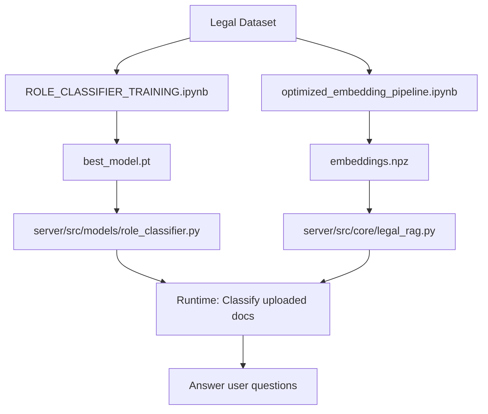

# Understanding the Training Notebooks

This document explains the purpose and differences between the two main notebooks in the Nyaya system.

## Quick Summary

| Notebook | Purpose | Output | When to Use |
|----------|---------|--------|-------------|
| **ROLE_CLASSIFIER_TRAINING.ipynb** | Train the role classifier model | Trained model weights (.pt) | One-time setup / model updates |
| **optimized_embedding_pipeline.ipynb** | Generate embeddings for RAG | Embedding vectors (.npz) | One-time setup / dataset updates |

---

## 1. ROLE_CLASSIFIER_TRAINING.ipynb

**Location**: [/home/uttam/B.Tech Major Project/nyaya/ROLE_CLASSIFIER_TRAINING.ipynb](../ROLE_CLASSIFIER_TRAINING.ipynb)

### What It Does

Trains the **InLegalBERT Role Classifier** to classify legal text into 7 rhetorical roles:
- Facts
- Issue
- Arguments of Petitioner
- Arguments of Respondent
- Reasoning
- Decision
- None

### Process Flow

```
Legal Text Dataset (with role labels)
    ↓
Load InLegalBERT pre-trained model
    ↓
Fine-tune on labeled Indian legal data
    ↓
Train classification head (768-dim → 7 classes)
    ↓
Output: Trained model weights (best_model.pt)
```

### Key Operations

1. **Loads** pre-trained InLegalBERT from Hugging Face
2. **Fine-tunes** on your labeled dataset
3. **Trains** classification layer to predict 7 roles
4. **Evaluates** performance with metrics (F1, precision, recall)
5. **Saves** trained model weights

### Input Required

- **Dataset**: TSV files with format: `sentence\trole`
- **Labels**: Each sentence labeled with one of 7 roles
- **Structure**: Train/validation/test splits

Example:
```
The petitioner filed a case on 2020-01-15    Facts
Whether the contract is valid?              Issue
The petitioner argues that...               Arguments of Petitioner
```

### Output Generated

```
trained_models/
├── best_model.pt                    # Trained model weights
├── training_history.json            # Training metrics over epochs
├── model_info.json                  # Model configuration
└── evaluation_results/
    ├── confusion_matrix.png         # Performance visualization
    └── metrics.json                 # Evaluation metrics
```

### Model Dimensions

- **Input**: Text → Tokenized (max 512 tokens)
- **Internal**: 768-dimensional representations (InLegalBERT)
- **Output**: 7-class probabilities (role prediction)

### When to Run

- **First time setup**: Train the classifier before running the server
- **Model updates**: When you have new labeled data
- **Performance improvement**: Re-train with different hyperparameters

---

## 2. optimized_embedding_pipeline.ipynb

**Location**: [/home/uttam/B.Tech Major Project/nyaya/server/embeddings/optimized_embedding_pipeline.ipynb](../server/embeddings/optimized_embedding_pipeline.ipynb)

### What It Does

Generates **InLegalBERT embeddings** for your legal dataset and saves them in compressed NPZ format for RAG retrieval.

### Process Flow

```
Legal Text Dataset
    ↓
Load InLegalBERT model (for embeddings only)
    ↓
Generate 768-dim embeddings in batches
    ↓
Save embeddings + metadata in NPZ format
    ↓
Output: Compressed embedding files (.npz)
```

### Key Operations

1. **Loads** InLegalBERT (same model, different purpose)
2. **Generates** 768-dimensional embeddings for each sentence
3. **Processes** dataset in streaming batches (memory efficient)
4. **Saves** embeddings in compressed NPZ format (~90% smaller than JSON)
5. **Preserves** role labels as metadata

### Input Required

- **Dataset**: Same TSV files as role classifier
- **Can handle**: Both labeled and unlabeled data
- **Structure**: Train/test/validation splits

### Output Generated

```
server/embeddings/
├── train_embeddings_inlegalbert.npz     # Training embeddings
├── test_embeddings_inlegalbert.npz      # Test embeddings
├── val_embeddings_inlegalbert.npz       # Validation embeddings
└── label_mapping_inlegalbert.json       # Role label mapping
```

### NPZ File Contents

Each `.npz` file contains:
- **vectors**: 2D array of embeddings (num_samples × 768)
- **texts**: Array of original text strings
- **labels**: Array of role names (if available)
- **label_numbers**: Array of role IDs (if available)
- **metadata**: Dataset information

### Loading Embeddings

```python
import numpy as np

# Load embeddings
with np.load('train_embeddings_inlegalbert.npz', allow_pickle=True) as data:
    embeddings = data['vectors']      # Shape: (num_samples, 768)
    texts = data['texts']              # Original sentences
    labels = data['labels']            # Role labels
    metadata = data['metadata'].item() # Dataset info
```

### Optimization Features

1. **Streaming Processing**: Processes 50 files at a time (low memory)
2. **Batch Embedding**: Generates embeddings in batches of 8
3. **Resumable**: Can continue if interrupted
4. **Compressed Storage**: NPZ format saves ~90% space vs JSON
5. **Progress Tracking**: Real-time progress monitoring

### Vector Dimensions

- **Input**: Text → Tokenized (max 512 tokens)
- **Output**: 768-dimensional embedding vector per sentence
- **Storage**: Compressed NPZ (efficient binary format)

### When to Run

- **First time setup**: Generate embeddings before using RAG
- **Dataset updates**: When you add new legal documents
- **Re-indexing**: When updating the vector database

---

## Key Differences

### Purpose

| ROLE_CLASSIFIER_TRAINING | optimized_embedding_pipeline |
|--------------------------|------------------------------|
| **Trains** a model to classify roles | **Generates** embeddings for retrieval |
| Creates a **classifier** | Creates **vector representations** |
| Supervised learning task | Feature extraction task |

### Model Usage

| ROLE_CLASSIFIER_TRAINING | optimized_embedding_pipeline |
|--------------------------|------------------------------|
| Fine-tunes InLegalBERT weights | Uses InLegalBERT as-is (frozen) |
| Adds classification layer | Uses only encoder outputs |
| Updates model parameters | No model training |

### Output Type

| ROLE_CLASSIFIER_TRAINING | optimized_embedding_pipeline |
|--------------------------|------------------------------|
| Model weights (.pt) | Embedding vectors (.npz) |
| ~400-500 MB | ~100-200 MB (compressed) |
| Used by role_classifier.py | Used by legal_rag.py |

### Computational Requirements

| ROLE_CLASSIFIER_TRAINING | optimized_embedding_pipeline |
|--------------------------|------------------------------|
| GPU recommended (training) | GPU optional (inference only) |
| Hours (10 epochs) | Minutes to hours (depends on dataset size) |
| High memory for batches | Streaming (low memory) |

---

## How They Work Together in Nyaya

### Training Phase (Run Once)

```
Step 1: ROLE_CLASSIFIER_TRAINING.ipynb
└── Trains InLegalBERT to classify roles
    └── Output: best_model.pt

Step 2: optimized_embedding_pipeline.ipynb
└── Generates embeddings with role metadata
    └── Output: train_embeddings_inlegalbert.npz
```

### Runtime Phase (Production Server)

```
User uploads legal document
    ↓
[Document Processor] Extracts text
    ↓
[Role Classifier] Uses best_model.pt → Predicts roles for each sentence
    ↓
[RAG System] Uses embeddings from .npz → Stores in ChromaDB with role tags
    ↓
User asks question → Role-aware retrieval → LLM generates answer
```

---

## Common Questions

### Q: Do I need to run both notebooks?

**Yes**, they serve different purposes:
- **ROLE_CLASSIFIER_TRAINING**: Creates the model that classifies text
- **optimized_embedding_pipeline**: Creates the vectors for retrieval

### Q: Which one do I run first?

**Either order works**, but recommended:
1. ROLE_CLASSIFIER_TRAINING (train classifier)
2. optimized_embedding_pipeline (generate embeddings)

### Q: Can I use different models?

- **Role Classifier**: Must use InLegalBERT (trained for Indian legal text)
- **RAG Embeddings**: Can use any embedding model (even smaller ones)

### Q: What about the 768 dimensions?

Both use 768-dim **internally**, but for different purposes:
- **Classifier**: 768-dim → classification layer → 7 role probabilities
- **Embeddings**: 768-dim vectors stored for similarity search

You can reduce RAG embedding dimensions (see [CLAUDE.md](../CLAUDE.md)) without affecting the classifier.

### Q: How much disk space do I need?

- **ROLE_CLASSIFIER_TRAINING**: ~500 MB (model weights)
- **optimized_embedding_pipeline**: ~100-200 MB per split (NPZ compressed)
- **Total**: ~700 MB - 1 GB for complete setup

---

## Integration with Server

### Role Classifier Usage

```python
# server/src/models/role_classifier.py
from transformers import AutoTokenizer, AutoModel

# Load your trained model
model = AutoModel.from_pretrained("law-ai/InLegalBERT")
model.load_state_dict(torch.load("best_model.pt"))

# Classify text
predictions = model(text_inputs)  # → 7-class probabilities
```

### RAG Embeddings Usage

```python
# server/src/core/legal_rag.py
import numpy as np

# Load pre-generated embeddings
with np.load("train_embeddings_inlegalbert.npz") as data:
    vectors = data['vectors']
    texts = data['texts']
    labels = data['labels']

# Store in ChromaDB with role metadata
vectorstore.add_embeddings(
    embeddings=vectors,
    texts=texts,
    metadatas=[{"role": label} for label in labels]
)
```

---

## Workflow Summary



---

## Next Steps

1. **Run ROLE_CLASSIFIER_TRAINING.ipynb** to train your classifier
2. **Run optimized_embedding_pipeline.ipynb** to generate embeddings
3. **Verify outputs** in respective directories
4. **Update server config** to point to trained models
5. **Start the server** and test with real documents

For more details, see:
- [CLAUDE.md](../CLAUDE.md) - Project overview
- [QUICK_START_GUIDE.md](./QUICK_START_GUIDE.md) - Setup instructions
- [SYSTEM_WORKFLOW_EXPLANATION.md](./SYSTEM_WORKFLOW_EXPLANATION.md) - How it all works together
